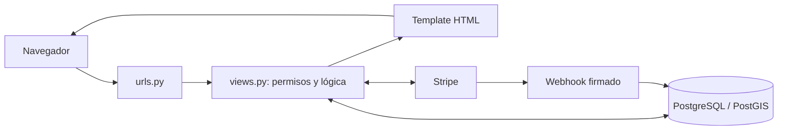

# Distans-Django

Aplicacion web para conectar comercios y compradores mediante Django, GeoDjango y PostgreSQL con PostGIS. El proyecto esta preparado para ejecutarse con Docker Compose, que proporciona Django, GDAL, PostgreSQL y PostGIS en un entorno reproducible.

Proyecto de TFG orientado al descubrimiento de comercios por proximidad y a la compra
online en tiendas con Premium activo. Django genera las páginas HTML en el servidor.

## Índice

- [Funcionalidades y roles](#funcionalidades-y-roles)
- [Datos de demostración](#datos-de-demostración)
- [Requisitos del entorno](#requisitos-del-entorno)
- [Instalación](#instalacion)
- [Pedidos, pagos y stock](#pedidos-pagos-y-stock)
- [Planes de las tiendas](#planes-de-las-tiendas)
- [Probar Stripe](#probar-stripe)
- [Arquitectura y datos](#arquitectura-y-datos)
- [Ejecutar las pruebas](#ejecutar-las-pruebas)
- [Comandos útiles](#comandos-utiles)
- [Problemas frecuentes](#problemas-frecuentes)
- [Detener el proyecto](#detener-el-proyecto)

## Funcionalidades y roles

| Acceso | Funcionalidades |
| --- | --- |
| Comprador | Catálogo, tiendas, mapa, filtros, favoritos, carrito, compra y consulta de sus pedidos. |
| Invitado | Acceso desde el botón de invitado, catálogo, mapa, carrito y compra sin crear una cuenta. Los favoritos requieren una cuenta de comprador. |
| Vendedor | Panel de su tienda, edición de información, productos, ofertas y stock, estadísticas de visitas y gestión de pedidos de su tienda. |
| Administrador | Gestión de usuarios, tiendas y pedidos; acceso al panel administrativo de Django. |

La identificación utiliza email y contraseña. El registro permite elegir comprador o
vendedor; el rol administrador no está disponible en el registro público. Tras iniciar
sesión, el rol determina la pantalla de entrada. Un vendedor tiene como máximo una
tienda; registrarse como vendedor no crea una tienda automáticamente. Para asignarla,
un administrador puede usar `/admin/` y seleccionar al vendedor al crear la tienda.

### Catálogo y búsqueda geográfica

- Productos organizados en ocho categorías, con imágenes, marca, precio, ofertas,
  disponibilidad, destacados y stock.
- Filtros por categoría, rango de precio y popularidad; el rango de precio utiliza el
  precio normal del producto.
- Modo de catálogo completo o limitado a tiendas que permiten compra online.
- Ubicación seleccionada en el mapa o solicitada al navegador, y radio en kilómetros.
  Estas preferencias se guardan en la sesión.
- El radio se aplica a la ubicación de la tienda, también al filtrar productos. Sin
  ubicación o sin radio no hay restricción por distancia; una tienda sin coordenadas
  queda fuera cuando se aplica un radio y no aparece como marcador.
- Mapas con Leaflet y fondo de OpenStreetMap. La distancia se calcula en Python mediante
  Haversine; la implementación actual no realiza consultas espaciales de distancia en PostGIS.

La popularidad es una métrica calculada a partir de visitas y pedidos, no reseñas de
usuarios. El panel del vendedor incluye visitas de tiendas y productos y actividad de
los últimos siete días. Para cuentas registradas se reutiliza una visita por usuario
y objeto; para invitados se permite registrar otra visita después de veinte minutos.

### Direcciones principales

Todas las rutas se sirven desde `http://localhost:8000` en el entorno local.

| Ruta | Uso |
| --- | --- |
| `/` | Redirección al inicio de sesión. |
| `/accounts/login/`, `/accounts/signup/` | Identificación y registro. |
| `/productos/`, `/productos/<id>/` | Catálogo y detalle del producto. |
| `/tiendas/`, `/tiendas/mapa/` | Listado y mapa de tiendas. |
| `/tiendas/<id>/productos/` | Productos de una tienda. |
| `/cuenta/`, `/favoritos/`, `/carrito/` | Cuenta, favoritos y carrito. |
| `/checkout/comprador/` | Inicio de la compra. |
| `/pedidos/mis-pedidos/`, `/pedidos/<codigo>/` | Historial y detalle de pedidos autorizados. |
| `/vendedor/` | Panel del vendedor. |
| `/gestion/usuarios/`, `/gestion/tiendas/` | Gestión administrativa. |
| `/gestion/pedidos/` | Gestión de pedidos del vendedor o administrador. |
| `/admin/` | Panel administrativo de Django. |
| `/api/pagos/stripe/webhook/` | Recepción de eventos firmados de Stripe por POST. |

## Datos de demostración

Después de levantar Docker y aplicar las migraciones, puedes preparar una demo completa:

```bash
docker compose exec web python manage.py seed_demo
```

El comando genera 11 usuarios, 8 tiendas, 24 productos de las ocho categorías,
5 pedidos en distintos estados, un carrito, favoritos y visitas para las estadísticas.
Incluye ofertas, productos agotados y no disponibles, y tiendas Freemium y Premium.
Las imágenes de ejemplo se generan localmente con Pillow en `media/demo/`; no requieren descargas.

Todas las cuentas nuevas tienen la contraseña **`DemoDistans2026!`**:

| Acceso | Email |
| --- | --- |
| Administrador | `admin@demo.example.com` |
| Comprador | `comprador@demo.example.com` |
| Segundo comprador | `comprador2@demo.example.com` |
| Vendedor Premium: librería | `libreria@demo.example.com` |
| Vendedor Premium: tecnología | `tecnologia@demo.example.com` |
| Vendedor Freemium: jardín | `jardin@demo.example.com` |
| Vendedor Premium: mercado | `mercado@demo.example.com` |
| Vendedor Freemium: hogar | `hogar@demo.example.com` |
| Vendedor Premium: Triana, Sevilla | `sevilla-triana@demo.example.com` |
| Vendedor Premium: Centro, Sevilla | `sevilla-centro@demo.example.com` |
| Vendedor Freemium: Nervión, Sevilla | `sevilla-nervion@demo.example.com` |

Entra en `http://localhost:8000`. Para probar el radio de búsqueda, selecciona Madrid
como ubicación (`40.416800`, `-3.703800`): cuatro tiendas están cerca del centro y otra
en Alcalá de Henares, fuera de un radio de 5 km.
También puedes seleccionar Sevilla (`37.389100`, `-5.984500`): encontrarás tres tiendas
en Centro, Triana y Nervión, con nueve productos de ejemplo.

Puedes repetir el comando sin duplicar registros. Conserva las contraseñas, el stock y
los pedidos ya existentes; añade los ejemplos que falten. Los datos y las direcciones
son ficticios. Los pedidos online pagados son ejemplos locales: el comando no llama a
Stripe ni cobra dinero. Premium se habilita localmente para la demo sin suscripciones
de Stripe. Puedes probar una compra completa con contrarrembolso sin configurar Stripe;
para probar pagos reales de prueba y suscripciones utiliza las claves de test de Stripe.

## Requisitos del entorno

- Git
- Docker Desktop con Docker Compose

No es necesario instalar Python, Django, GDAL ni PostgreSQL en Windows si se utiliza Docker.

## Instalacion

### 1. Clonar el repositorio

```bash
git clone https://github.com/STX3837/Distans-Django.git
cd Distans-Django
```

### 2. Crear el archivo `.env`

Crea `.env` en la raiz del proyecto, junto a `docker-compose.yml`:

```env
DB_NAME=mi_base_datos
DB_USER=mi_usuario
DB_PASSWORD=una_contrasena_segura

# Opcional. Necesario para probar los pagos con Stripe.
STRIPE_PUBLIC_KEY=pk_test_REPLACE_WITH_YOUR_KEY
STRIPE_SECRET_KEY=sk_test_REPLACE_WITH_YOUR_KEY
STRIPE_WEBHOOK_SECRET=whsec_REPLACE_WITH_YOUR_SECRET

# Opcionales para el entorno local.
DEBUG=True
ALLOWED_HOSTS=localhost,127.0.0.1
```

El archivo `.env` no debe subirse al repositorio. Para una prueba sin Stripe se pueden dejar vacias sus tres variables; el pago contra reembolso seguira disponible.

### 3. Construir y arrancar los servicios

Con Docker Desktop en ejecucion:

```bash
docker compose up -d --build
```

La primera ejecucion puede tardar varios minutos. Los servicios principales son:

- `web`: aplicacion Django en `http://localhost:8000`.
- `db`: PostgreSQL con PostGIS.
- `cart_cleanup`: limpieza automatica de carritos de invitados caducados.
- `order_cleanup`: comprobación de pagos abandonados cada minuto.

La base de datos es accesible desde el equipo en `localhost:5433`; entre contenedores
se usa `db:5432`. El volumen `postgres_data` conserva los datos. Las imágenes subidas
se almacenan en `media/`, que se comparte con el contenedor de Django.

### 4. Aplicar migraciones

```bash
docker compose exec web python manage.py migrate
```

Si la base de datos aun esta arrancando, espera unos segundos y repite el comando.

### 5. Crear un usuario administrador

```bash
docker compose exec web python manage.py createsuperuser
```

El panel de administracion esta disponible en `http://localhost:8000/admin`.

Puedes omitir `createsuperuser` si utilizas el administrador que crea `seed_demo`.
Para una demo con contenido, ejecuta el comando de la sección de datos de demostración
después de `migrate`.

### Configuración del entorno

| Variable | Función |
| --- | --- |
| `DB_NAME`, `DB_USER`, `DB_PASSWORD` | Base de datos y credenciales compartidas por los servicios. |
| `DB_HOST`, `DB_PORT` | Docker Compose los fija a `db` y `5432`. |
| `SECRET_KEY` | Clave de Django, leída del entorno o del `.env`. |
| `DEBUG` | Activa el modo de desarrollo y el servicio local de imágenes; por defecto está activo. |
| `ALLOWED_HOSTS` | Hosts admitidos, separados por comas. |
| `STRIPE_PUBLIC_KEY`, `STRIPE_SECRET_KEY` | Claves públicas y secretas para Stripe. |
| `STRIPE_WEBHOOK_SECRET` | Secreto para comprobar la firma de los eventos recibidos. |
| `CART_CLEANUP_INTERVAL_SECONDS` | Intervalo del servicio `cart_cleanup`; se configura en Compose y vale `86400` por defecto. |

`nucleo/settings.py` lee `.env` sin sobrescribir variables ya presentes en el entorno.
Tras cambiar variables de Stripe o Compose, recrea los servicios para que reciban los
nuevos valores: `docker compose up -d --force-recreate web order_cleanup`.

## Pedidos, pagos y stock

La compra tiene tres pasos: datos del comprador, direcciones de envío y facturación,
y método de pago. Los formularios validan datos personales, teléfono, direcciones y
códigos postales españoles. Para usuarios registrados se proponen sus datos de cuenta.

Los importes se calculan con `Decimal` y se redondean a céntimos. La configuración actual
aplica un impuesto del **21 %** a la base después de descuentos y un coste de envío de
**0 €**, definidos en `orders/utils.py`:

```text
total = subtotal a precio normal - descuentos + impuesto + coste de entrega
```

### Estado del pedido y estado del pago

| Estado del pedido | Significado |
| --- | --- |
| `pendiente_pago` | Esperando confirmación del pago online. |
| `preparacion` | Pedido aceptado, en preparación. |
| `enviado` | En reparto. |
| `entregado` | Entrega registrada. |
| `cancelado` | Pedido cancelado. |
| `completado` | Estado heredado, mantenido por compatibilidad; los nuevos pedidos aceptados pasan a preparación. |

Desde la gestión se permite preparación → enviado → entregado, sin saltar pasos.
La cancelación está disponible antes del envío; un pago online en proceso debe
comprobarse con Stripe antes de liberar su reserva.

| Estado del pago | Significado |
| --- | --- |
| `pendiente` | Pago online no confirmado. |
| `pagado` | Pago online confirmado. |
| `cobro_tienda` | Contrarrembolso gestionado por cada tienda al entregar. |
| `cancelado` | Pago cancelado. |
| `reembolso_pendiente` | Pedido pagado cancelado o pago tardío para un pedido cancelado. |

En **contrarrembolso**, el comprador paga en persona al repartidor de cada tienda cuando
recibe sus productos. DISTANS no cobra ni registra si el repartidor ha recibido el
dinero. Registrar la entrega no cambia ese estado del pago.

Con **pasarela**, el comprador se redirige a Stripe Checkout. El retorno y los webhooks
confirman el pago; las notificaciones repetidas no reinician el estado de preparación
o envío. Los reembolsos pendientes se tramitan manualmente en Stripe: la aplicación no
ejecuta ni concilia reembolsos automáticamente.

### Reservas y conservación del historial

Al crear un pedido se vuelven a comprobar stock, disponibilidad y precio. Las filas de
productos se bloquean dentro de una transacción para evitar vender las mismas últimas
unidades en compras simultáneas. El stock se descuenta al crear el pedido.

Los pagos online tienen una reserva inicial de **35 minutos**. `order_cleanup` revisa
reservas caducadas cada minuto. Primero cierra el checkout si sigue abierto y después
repone stock. Si el pago está confirmado, lo registra; si está procesándose o Stripe no
responde, conserva la reserva. Cancelar antes del envío repone el stock descontado una
sola vez, omitiendo productos que ya no existen.

Las líneas del pedido conservan nombre del producto, nombre de la tienda, precio,
cantidad y vínculo con la tienda aunque se elimine el producto. Los invitados consultan
los pedidos vinculados a su sesión; conocer un código ajeno no concede acceso.

## Planes de las tiendas

| Plan | Comportamiento |
| --- | --- |
| Freemium | Visibilidad en catálogo y mapa; compra de sus productos en la tienda física. |
| Premium | Compra online cuando la suscripción y la pasarela están activas y la vigencia no ha caducado. |

La contratación de Premium utiliza una suscripción de Stripe de **14,99 € al mes**.
Se conserva el identificador de la suscripción y se sincroniza el estado actual y el
fin real de su período, en lugar de sumar treinta días al recibir un evento. Una
cancelación al final del período conserva acceso mientras la suscripción siga activa
y vigente. Los fallos de cobro y cancelaciones se reflejan consultando Stripe.

El vendedor no puede cambiar el plan desde su formulario de información de tienda.
Los administradores pueden configurar planes locales; la demo usa Premium local sin
identificadores ficticios de Stripe. Si una tienda local no tiene fecha de renovación,
su vigencia no caduca por fecha.

## Probar Stripe

### Recibir eventos en local

Instala y autentica la [CLI oficial de Stripe](https://docs.stripe.com/stripe-cli).
Ejecuta en una terminal del equipo, fuera de Docker:

```bash
stripe login
stripe listen --forward-to http://localhost:8000/api/pagos/stripe/webhook/
```

Copia el secreto `whsec_...` que muestra `listen` a `STRIPE_WEBHOOK_SECRET` en `.env`,
recrea `web` y mantén la terminal del listener abierta. El secreto del listener puede
ser distinto del secreto de un endpoint configurado en el Dashboard. Stripe no puede
acceder directamente al `localhost` de tu dispositivo; la CLI reenvía los eventos.
[Documentación de webhooks de Stripe](https://docs.stripe.com/webhooks).

Eventos que procesa la integración:

- `checkout.session.completed`, `checkout.session.async_payment_succeeded`,
  `checkout.session.async_payment_failed`, `checkout.session.expired`.
- `customer.subscription.created`, `customer.subscription.updated`,
  `customer.subscription.deleted`.
- `invoice.paid`, `invoice.payment_failed`.

Para probar Premium, entra con un vendedor Freemium de la demo. Para probar una compra
online, utiliza productos de una tienda Premium. Los pedidos creados por `seed_demo`
no sustituyen una prueba del checkout de Stripe.

### Tarjeta de prueba

Stripe debe utilizarse en modo test. Al iniciar el pago mediante pasarela, utiliza estos datos:

| Campo | Valor |
| --- | --- |
| Numero de tarjeta | `4242 4242 4242 4242` |
| Caducidad | Cualquier fecha futura, por ejemplo `12/34` |
| CVC | Cualquier numero de tres digitos, por ejemplo `123` |
| Codigo postal | Cualquier codigo postal valido |

No utilices tarjetas reales. Las claves `pk_test_`, `sk_test_` y `whsec_` deben pertenecer a una cuenta de Stripe en modo test.
Referencia: [tarjetas de prueba de Stripe](https://docs.stripe.com/testing#cards).

## Arquitectura y datos

El entorno Docker utiliza Python 3.11, Django 4.2, PostgreSQL 15 y PostGIS 3.4.
`requirements.txt` declara las dependencias de Python, incluidas Pillow y Stripe.
El Dockerfile instala las bibliotecas de GDAL y PROJ para GeoDjango.

```text
nucleo/       Configuración, rutas generales, WSGI y ASGI.
users/        Usuarios, roles, cuenta, favoritos y comando seed_demo.
stores/       Tiendas, planes, mapa y filtros geográficos.
products/     Productos, catálogo, stock y panel del vendedor.
carts/        Modelos de carrito, resumen compartido y limpieza de invitados.
orders/       Checkout, pagos, pedidos y limpieza de reservas.
templates/    Base HTML, cabecera, navegación y plantillas compartidas.
scripts/      Bucles de mantenimiento ejecutados por Docker Compose.
media/        Imágenes subidas y generadas para la demo; no se versiona.
```

Cada aplicación incluye sus modelos, vistas, formularios, rutas, migraciones y
plantillas según sus responsabilidades. Actualmente las vistas de carrito están en
`products/views.py`, aunque sus modelos y su plantilla pertenecen a `carts/`.



Relaciones principales: vendedor → una tienda → muchos productos; comprador → un
carrito → líneas con cantidad; usuario → pedidos → líneas con precios de la compra.
Un pedido puede pertenecer a un usuario o ser de un invitado. Favoritos y visitas
referencian productos o tiendas. El carrito del registrado utiliza líneas en la base
de datos; el invitado guarda las líneas en su sesión y tiene un registro de carrito
asociado a ella.

Las credenciales y las tablas viven en PostgreSQL; las imágenes se guardan mediante
el almacenamiento de Django y la base de datos conserva su ruta. Las migraciones
versionadas crean y actualizan las tablas, pero no introducen automáticamente la demo.
La interfaz está en español; la configuración actual de Django usa `en-us` y zona horaria UTC.

## Ejecutar las pruebas

La suite completa se ejecuta dentro del contenedor para disponer de PostGIS y GDAL:

```bash
docker compose run --rm web python manage.py test
```

Comprobar que no faltan migraciones:

```bash
docker compose run --rm web python manage.py makemigrations --check --dry-run
```

La suite cubre usuarios y permisos, favoritos, filtros geográficos, checkout,
contrarrembolso, pagos, Premium, cancelaciones, stock e idempotencia de la demo.
Las pruebas usan su propia base de datos; no cargan la demo en la base de desarrollo.

Como alternativa sin PostgreSQL, con las dependencias Python instaladas:

```bash
python manage.py test --settings=nucleo.settings_test
```

Esta configuración usa SQLite en memoria, imágenes en `.test-downloads/media` y hashing
reducido exclusivamente para pruebas. La prueba de compras simultáneas se omite en
SQLite porque necesita los bloqueos de filas de PostgreSQL. No utilices
`settings_test` para ejecutar la aplicación con datos de usuarios.

## Comandos utiles

Ver los logs de Django:

```bash
docker compose logs -f web
```

Abrir un shell de Django:

```bash
docker compose exec web python manage.py shell
```

Crear nuevas migraciones:

```bash
docker compose exec web python manage.py makemigrations
```

Limpiar carritos de invitados manualmente:

```bash
docker compose exec web python manage.py cleanup_guest_carts
```

Simular la limpieza sin borrar datos:

```bash
docker compose exec web python manage.py cleanup_guest_carts --dry-run
```

Ver los logs del limpiador automatico:

```bash
docker compose logs -f cart_cleanup
```

El limpiador se ejecuta cada 24 horas por defecto. El intervalo se puede cambiar con `CART_CLEANUP_INTERVAL_SECONDS` en `docker-compose.yml`.

Ese mismo servicio ejecuta `expire_premium_stores` para desactivar planes caducados.
Los filtros y el carrito comprueban la vigencia aunque el limpiador aún no se haya ejecutado.

```bash
docker compose exec web python manage.py expire_premium_stores
docker compose exec web python manage.py cleanup_pending_orders
docker compose logs -f order_cleanup
docker compose ps
docker compose exec web python manage.py check
```

Para incorporar cambios de código y migraciones:

```bash
docker compose up -d --build
docker compose exec web python manage.py migrate
```

## Problemas frecuentes

| Problema | Comprobación o solución |
| --- | --- |
| Docker no conecta con su motor | Arranca Docker Desktop y comprueba `docker compose ps`. |
| Django no conecta con PostgreSQL | Comprueba `docker compose logs db`, las variables de base de datos y que el servicio haya terminado de arrancar. |
| Error de tabla o columna inexistente | Ejecuta `python manage.py migrate` dentro de `web`. |
| Catálogo vacío | Ejecuta `seed_demo`; revisa ubicación, radio, categoría y modo de catálogo. |
| No aparece una tienda en el mapa | Revisa sus coordenadas y el radio. Para la demo selecciona Madrid o Sevilla según las tiendas que quieras ver. |
| Fondo del mapa con «Access blocked» / 403 | Recarga con Ctrl + F5. Las capas envían referencia del origen; revisa si el navegador o una extensión la elimina. OpenStreetMap puede rechazar peticiones que incumplan su política. |
| No aparecen imágenes | Comprueba `media/`, el volumen compartido y `DEBUG=True` en desarrollo. |
| No se puede añadir un producto al carrito | Comprueba stock, disponibilidad y que su tienda permita compra online. |
| Stripe no está configurado | Añade claves de test válidas; para probar sin Stripe usa contrarrembolso. |
| Premium no se actualiza o falla la firma del webhook | Comprueba el listener, el secreto `whsec_` y los logs de `web`. |
| Una reserva no se libera | Revisa `order_cleanup`: conserva el stock si Stripe no responde o el pago está procesándose. |
| Miles de archivos pendientes en Git | `.test-deps/` y `.test-downloads/` son archivos locales de pruebas y deben permanecer ignorados. |

La demo genera imágenes sin internet, pero el fondo del mapa, Leaflet desde CDN y los
pagos de Stripe necesitan acceso a servicios externos. Referencia para el mapa:
[política de uso de imágenes de OpenStreetMap](https://operations.osmfoundation.org/policies/tiles/).

## Alcance actual

Docker Compose ejecuta el servidor de desarrollo `runserver`; este entorno está
preparado para desarrollar y evaluar el TFG, no constituye un despliegue de producción.
Un despliegue público requiere configurar servidor de aplicación, HTTPS, secretos,
hosts y servicio de archivos estáticos y media.

Los pedidos tienen un estado global aunque incluyan productos de varias tiendas;
no existe todavía seguimiento independiente de cada envío, integración con repartidores
ni registro del cobro en persona. Las renovaciones Premium se reflejan mediante Stripe,
y los reembolsos online se gestionan manualmente fuera de la aplicación.

## Detener el proyecto

```bash
docker compose down
```

Para detener los contenedores y eliminar tambien el volumen de PostgreSQL:

```bash
docker compose down -v
```

El segundo comando borra los datos almacenados en la base de datos.
