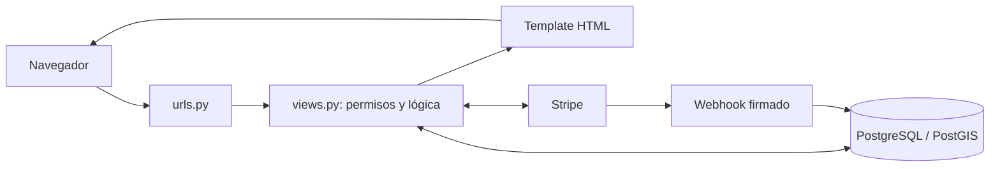

# 🌍 Distans-Django


Aplicación web para conectar comercios y compradores mediante Django, GeoDjango y PostgreSQL con PostGIS. El proyecto está preparado para ejecutarse con Docker Compose, que proporciona Django, GDAL, PostgreSQL y PostGIS en un entorno reproducible.

Desarrollo backend/frontend del Trabajo de Fin de Grado «Diseño y desarrollo de un marketplace geolocalizado para el fomento del comercio de proximidad», orientado al descubrimiento de comercios por proximidad y a la compra online en tiendas con Premium activo. Django genera las páginas HTML en el servidor.

## 📑 Índice

- [1. Características Principales y Roles](#1-características-principales-y-roles)
- [2. Arquitectura y Tecnologías](#2-arquitectura-y-tecnologías)
- [3. Requisitos Previos](#3-requisitos-previos)
- [4. Guía de Instalación y Despliegue Local](#4-guía-de-instalación-y-despliegue-local)
- [5. Carga de Datos de Demostración (Seed)](#5-carga-de-datos-de-demostración-seed)
- [6. Lógica de Negocio: Pedidos, Pagos y Stock](#6-lógica-de-negocio-pedidos-pagos-y-stock)
- [7. Integración con Stripe](#7-integración-con-stripe)
- [8. Ejecución de Pruebas y Benchmarking](#8-ejecución-de-pruebas-y-benchmarking)
- [9. Comandos de Administración Útiles](#9-comandos-de-administración-útiles)
- [10. Resolución de Problemas (FAQ)](#10-resolución-de-problemas-faq)
- [11. Detener el Proyecto y Limpiar Datos](#11-detener-el-proyecto-y-limpiar-datos)

## 1. Características Principales y Roles

| Acceso | Funcionalidades |
| --- | --- |
| Comprador | Catálogo, tiendas, mapa, filtros, favoritos, carrito, compra y consulta de sus pedidos. |
| Invitado | Acceso desde el botón de invitado, catálogo, mapa, carrito y compra sin crear una cuenta. Los favoritos requieren una cuenta de comprador. |
| Vendedor | Panel de su tienda, edición de información, productos, ofertas y stock, estadísticas de visitas y gestión de pedidos de su tienda. |
| Administrador | Gestión de usuarios, tiendas y pedidos; acceso al panel administrativo de Django. |

La identificación utiliza email y contraseña. El registro permite elegir comprador o
vendedor; el rol administrador no está disponible en el registro público. Tras iniciar
sesión, el rol determina la pantalla de entrada. Un vendedor tiene como máximo una
tienda; registrarse como vendedor no crea una tienda automáticamente. Para asignarla,
un administrador puede usar `/admin/` y seleccionar al vendedor al crear la tienda.

### Catálogo y búsqueda geográfica

- Productos organizados en ocho categorías, con imágenes, marca, precio, ofertas,
  disponibilidad, destacados y stock.
- Filtros por categoría, rango de precio y popularidad; el rango de precio utiliza el
  precio normal del producto.
- Modo de catálogo completo o limitado a tiendas que permiten compra online.
- Ubicación seleccionada en el mapa o solicitada al navegador, y radio en kilómetros.
  Estas preferencias se guardan en la sesión.
- El radio se aplica a la ubicación de la tienda, también al filtrar productos. Sin
  ubicación o sin radio no hay restricción por distancia; una tienda sin coordenadas
  queda fuera cuando se aplica un radio y no aparece como marcador.
- Mapas con Leaflet y fondo de OpenStreetMap. La distancia se calcula en Python mediante
  Haversine; la implementación actual no realiza consultas espaciales de distancia en PostGIS.

La popularidad es una métrica calculada a partir de visitas y pedidos, no reseñas de
usuarios. El panel del vendedor incluye visitas de tiendas y productos y actividad de
los últimos siete días. Para cuentas registradas se reutiliza una visita por usuario
y objeto; para invitados se permite registrar otra visita después de veinte minutos.

### Direcciones principales

Todas las rutas se sirven desde `http://localhost:8000` en el entorno local.

| Ruta | Uso |
| --- | --- |
| `/` | Redirección al inicio de sesión. |
| `/accounts/login/`, `/accounts/signup/` | Identificación y registro. |
| `/accounts/password-reset/` | Solicitud de restablecimiento de contraseña. |
| `/productos/`, `/productos/<id>/` | Catálogo y detalle del producto. |
| `/tiendas/`, `/tiendas/mapa/` | Listado y mapa de tiendas. |
| `/tiendas/<id>/productos/` | Productos de una tienda. |
| `/cuenta/`, `/favoritos/`, `/carrito/` | Cuenta, favoritos y carrito. |
| `/checkout/comprador/` | Inicio de la compra. |
| `/pedidos/mis-pedidos/`, `/pedidos/<codigo>/` | Historial y detalle de pedidos autorizados. |
| `/vendedor/` | Panel del vendedor. |
| `/gestion/usuarios/`, `/gestion/tiendas/` | Gestión administrativa. |
| `/gestion/pedidos/` | Gestión de pedidos del vendedor o administrador. |
| `/admin/` | Panel administrativo de Django. |
| `/api/pagos/stripe/webhook/` | Recepción de eventos firmados de Stripe por POST. |

## 2. Arquitectura y Tecnologías

El entorno Docker utiliza Python 3.11, Django 4.2, PostgreSQL 15 y PostGIS 3.4.
`requirements.txt` declara las dependencias de Python, incluidas Pillow y Stripe.
El Dockerfile instala las bibliotecas de GDAL y PROJ para GeoDjango.

```text
nucleo/       Configuración, rutas generales, WSGI y ASGI.
users/        Usuarios, roles, cuenta, favoritos y comando seed_demo.
stores/       Tiendas, planes, mapa y filtros geográficos.
products/     Productos, catálogo, stock y panel del vendedor.
carts/        Modelos de carrito, resumen compartido y limpieza de invitados.
orders/       Checkout, pagos, pedidos y limpieza de reservas.
templates/    Base HTML, cabecera, navegación y plantillas compartidas.
scripts/      Bucles de mantenimiento ejecutados por Docker Compose.
media/        Imágenes subidas y generadas para la demo; no se versiona.
```

Cada aplicación incluye sus modelos, vistas, formularios, rutas, migraciones y
plantillas según sus responsabilidades. Actualmente las vistas de carrito están en
`products/views.py`, aunque sus modelos y su plantilla pertenecen a `carts/`.


```mermaid
flowchart LR
    N[Navegador] --> U[urls.py]
    U --> V[views.py: permisos y lógica]
    V <--> D[(PostgreSQL / PostGIS)]
    V --> T[Template HTML]
    T --> N
    V <--> S[Stripe]
    S --> W[Webhook firmado]
    W --> D
```

Relaciones principales: vendedor → una tienda → muchos productos; comprador → un
carrito → líneas con cantidad; usuario → pedidos → líneas con precios de la compra.
Un pedido puede pertenecer a un usuario o ser de un invitado. Favoritos y visitas
referencian productos o tiendas. El carrito del registrado utiliza líneas en la base
de datos; el invitado guarda las líneas en su sesión y tiene un registro de carrito
asociado a ella.

Las credenciales y las tablas viven en PostgreSQL; las imágenes se guardan mediante
el almacenamiento de Django y la base de datos conserva su ruta. Las migraciones
versionadas crean y actualizan las tablas, pero no introducen automáticamente la demo.
La interfaz está en español; la configuración actual de Django usa `en-us` y zona horaria UTC.

### Alcance actual

Docker Compose ejecuta el servidor de desarrollo `runserver`; este entorno está
preparado para desarrollar y evaluar el TFG, no constituye un despliegue de producción.
Un despliegue público requiere configurar servidor de aplicación, HTTPS, secretos,
hosts y servicio de archivos estáticos y media.

Los pedidos tienen un estado global aunque incluyan productos de varias tiendas;
no existe todavía seguimiento independiente de cada envío, integración con repartidores
ni registro del cobro en persona. Las renovaciones Premium se reflejan mediante Stripe,
y los reembolsos online se gestionan manualmente fuera de la aplicación.

## 3. Requisitos Previos

- Git
- Docker Desktop con Docker Compose

No es necesario instalar Python, Django, GDAL ni PostgreSQL localmente, ya que la contenerización proporciona y aísla estas dependencias.

## 4. Guía de Instalación y Despliegue Local

### 1. Clonar el repositorio

```bash
git clone https://github.com/STX3837/Distans-Django.git
cd Distans-Django
```

### 2. Crear el archivo `.env`

El archivo `.env` debe crearse en la raiz del proyecto, junto a `docker-compose.yml`:

```env
DB_NAME=distans_db
DB_USER=distans_user
DB_PASSWORD=una_contrasena_segura

# Opcional. Necesario para probar los pagos con Stripe.
STRIPE_PUBLIC_KEY=pk_test_REPLACE_WITH_YOUR_KEY
STRIPE_SECRET_KEY=sk_test_REPLACE_WITH_YOUR_KEY
STRIPE_WEBHOOK_SECRET=whsec_REPLACE_WITH_YOUR_SECRET

# Opcionales para el entorno local.
DEBUG=True
ALLOWED_HOSTS=localhost,127.0.0.1
```

El archivo `.env` no debe subirse al repositorio. Para una prueba sin Stripe se pueden dejar vacias sus tres variables; el pago contra reembolso seguira disponible.

### 3. Construir y arrancar los servicios

Con Docker Desktop en ejecucion:

```bash
docker compose up -d --build
```

La primera ejecucion puede tardar varios minutos. Los servicios principales son:

- `web`: aplicacion Django en `http://localhost:8000`.
- `db`: PostgreSQL con PostGIS.
- `cart_cleanup`: limpieza automatica de carritos de invitados caducados.
- `order_cleanup`: comprobación de pagos abandonados cada minuto.

La base de datos es accesible desde el equipo en `localhost:5433`; entre contenedores
se usa `db:5432`. El volumen `postgres_data` conserva los datos. Las imágenes subidas
se almacenan en `media/`, que se comparte con el contenedor de Django.

### 4. Aplicar migraciones

```bash
docker compose exec web python manage.py migrate
```

Si la base de datos aun esta arrancando, el comando debe repetirse tras unos segundos.

### 5. Crear un usuario administrador

```bash
docker compose exec web python manage.py createsuperuser
```

El panel de administracion esta disponible en `http://localhost:8000/admin`.

El paso `createsuperuser` puede omitirse si se utiliza el administrador creado por `seed_demo`.
Para obtener una demo con contenido, se ejecuta el comando de la sección de datos de demostración
después de `migrate`.

### Configuración del entorno

| Variable | Función |
| --- | --- |
| `DB_NAME`, `DB_USER`, `DB_PASSWORD` | Base de datos y credenciales compartidas por los servicios. |
| `DB_HOST`, `DB_PORT` | Docker Compose los fija a `db` y `5432`. |
| `SECRET_KEY` | Clave de Django, leída del entorno o del `.env`. |
| `DEBUG` | Activa el modo de desarrollo y el servicio local de imágenes; por defecto está activo. |
| `ALLOWED_HOSTS` | Hosts admitidos, separados por comas. |
| `STRIPE_PUBLIC_KEY`, `STRIPE_SECRET_KEY` | Claves públicas y secretas para Stripe. |
| `STRIPE_WEBHOOK_SECRET` | Secreto para comprobar la firma de los eventos recibidos. |
| `CART_CLEANUP_INTERVAL_SECONDS` | Intervalo del servicio `cart_cleanup`; se configura en Compose y vale `86400` por defecto. |

`nucleo/settings.py` lee `.env` sin sobrescribir variables ya presentes en el entorno.
Tras cambiar variables de Stripe o Compose, recrea los servicios para que reciban los
nuevos valores: `docker compose up -d --force-recreate web order_cleanup`.

## 5. Carga de Datos de Demostración (Seed)

Después de levantar Docker y aplicar las migraciones, la fixture completa se prepara con:

```bash
docker compose exec web python manage.py seed_demo
```

El comando sincroniza 11 usuarios, 8 tiendas, 24 productos de las ocho categorías,
5 pedidos coherentes, un carrito, dos favoritos y visitas históricas. Todos los datos y
direcciones son ficticios.

### Usuarios

Las cuentas que se creen por primera vez reciben la contraseña
**`DemoDistans2026!`**. Repetir el seed conserva una contraseña que se haya cambiado:

| Acceso | Email |
| --- | --- |
| Administrador | `admin@demo.example.com` |
| Comprador | `comprador@demo.example.com` |
| Segundo comprador | `comprador2@demo.example.com` |
| Vendedor Premium: librería | `libreria@demo.example.com` |
| Vendedor Premium: tecnología | `tecnologia@demo.example.com` |
| Vendedor Freemium: jardín | `jardin@demo.example.com` |
| Vendedor Premium: mercado | `mercado@demo.example.com` |
| Vendedor Freemium: hogar | `hogar@demo.example.com` |
| Vendedor Premium: Triana, Sevilla | `sevilla-triana@demo.example.com` |
| Vendedor Premium: Centro, Sevilla | `sevilla-centro@demo.example.com` |
| Vendedor Freemium: Nervión, Sevilla | `sevilla-nervion@demo.example.com` |

Los vendedores tienen `rol=vendedor`; los dos compradores, `rol=comprador`; y el
administrador tiene `rol=admin`, `is_staff=True` e `is_superuser=True`. Todos incluyen
nombre, apellidos, teléfono `600123123`, dirección `Calle Demo 10` y código postal
`28001`, excepto las cuentas de Sevilla, que utilizan `41001`.

### Tiendas

| Tienda | Vendedor | Ciudad y dirección | Coordenadas | Plan |
| --- | --- | --- | --- | --- |
| Librería Horizonte Demo | `libreria@demo.example.com` | Madrid, Calle Demo 1 | 40.416800, -3.703800 | Premium |
| Tecnología Centro Demo | `tecnologia@demo.example.com` | Madrid, Calle Demo 2 | 40.420000, -3.700000 | Premium |
| Jardín del Barrio Demo | `jardin@demo.example.com` | Madrid, Calle Demo 3 | 40.430000, -3.710000 | Freemium |
| Mercado Artesano Demo | `mercado@demo.example.com` | Madrid, Calle Demo 4 | 40.460000, -3.690000 | Premium |
| Hogar Alcalá Demo | `hogar@demo.example.com` | Alcalá de Henares, Calle Demo 5 | 40.481000, -3.364000 | Freemium |
| Artesanía Triana Demo | `sevilla-triana@demo.example.com` | Sevilla, Calle Demo Triana 1 | 37.383000, -6.003000 | Premium |
| Librería Sevilla Centro Demo | `sevilla-centro@demo.example.com` | Sevilla, Calle Demo Centro 2 | 37.389100, -5.984500 | Premium |
| Flores Nervión Demo | `sevilla-nervion@demo.example.com` | Sevilla, Calle Demo Nervión 3 | 37.382500, -5.970000 | Freemium |

Todas utilizan un horario de lunes a viernes de 09:00 a 20:00. Las Premium tienen
suscripción y pasarela activas solo para la demo local. No se inventan identificadores
de Stripe: `stripe_subscription_id` y `premium_hasta` quedan vacíos y
`fecha_renovacion=None` permite mantenerlas activas en este entorno. Las Freemium tienen
suscripción y pasarela desactivadas.

### Productos

La columna «Stock final» refleja los pedidos creados por el propio seed. La novela parte
de 25 unidades y termina con 22; los auriculares parten de 20 y terminan con 19 porque
el pedido cancelado restaura su unidad.

Todos usan la marca `DISTANS Demo`. Su descripción es el nombre seguido de «Producto
ficticio para la demostración». Se marca como destacado uno de cada tres elementos
(posiciones 1, 4, 7…, con índices internos 0, 3, 6…), tal como se indica en Estado.

| Tienda | Producto | Categoría | Precio | Oferta | Stock final | Estado |
| --- | --- | --- | ---: | ---: | ---: | --- |
| Librería Horizonte | Novela de aventuras | Cultura y ocio | 18,00 € | 14,00 € | 22 | Disponible, destacado |
| Librería Horizonte | Juego de mesa familiar | Cultura y ocio | 32,00 € | — | 12 | Disponible |
| Librería Horizonte | Cuaderno de notas | Papelería y oficina | 6,50 € | — | 40 | Disponible |
| Tecnología Centro | Auriculares inalámbricos | Tecnología y electrónica | 49,90 € | 39,90 € | 19 | Disponible, destacado |
| Tecnología Centro | Teclado compacto | Tecnología y electrónica | 29,90 € | — | 10 | Disponible |
| Tecnología Centro | Ratón agotado | Tecnología y electrónica | 15,00 € | — | 0 | Agotado |
| Jardín del Barrio | Planta de interior | Floristería y jardinería | 12,00 € | — | 18 | Disponible, destacado |
| Jardín del Barrio | Ramo de flores | Floristería y jardinería | 25,00 € | 20,00 € | 8 | Disponible |
| Jardín del Barrio | Maceta de cerámica | Hogar y bricolaje | 9,50 € | — | 15 | Disponible |
| Mercado Artesano | Cesta de productos artesanos | Alimentación y bebidas | 24,00 € | 21,00 € | 20 | Disponible, destacado |
| Mercado Artesano | Bolsa de tela | Moda y complementos | 8,00 € | — | 30 | Disponible |
| Mercado Artesano | Jabón artesanal | Salud y bienestar | 5,00 € | — | 35 | Disponible |
| Hogar Alcalá | Lámpara de escritorio | Hogar y bricolaje | 35,00 € | — | 10 | Disponible, destacado |
| Hogar Alcalá | Kit de herramientas | Hogar y bricolaje | 42,00 € | — | 7 | Disponible |
| Hogar Alcalá | Organizador no disponible | Papelería y oficina | 11,00 € | — | 5 | No disponible |
| Artesanía Triana | Azulejo decorativo | Hogar y bricolaje | 18,00 € | 15,00 € | 20 | Disponible, destacado |
| Artesanía Triana | Abanico artesanal | Moda y complementos | 22,00 € | — | 15 | Disponible |
| Artesanía Triana | Taza de cerámica sevillana | Hogar y bricolaje | 12,00 € | — | 25 | Disponible |
| Librería Sevilla Centro | Guía de paseos por Sevilla | Cultura y ocio | 16,50 € | 13,50 € | 30 | Disponible, destacado |
| Librería Sevilla Centro | Cuaderno ilustrado | Papelería y oficina | 7,50 € | — | 40 | Disponible |
| Librería Sevilla Centro | Juego de cartas | Cultura y ocio | 9,00 € | — | 18 | Disponible |
| Flores Nervión | Ramo de temporada | Floristería y jardinería | 28,00 € | 24,00 € | 12 | Disponible, destacado |
| Flores Nervión | Planta aromática | Floristería y jardinería | 6,00 € | — | 20 | Disponible |
| Flores Nervión | Jardinera de balcón | Hogar y bricolaje | 19,00 € | — | 10 | Disponible |

### Imágenes predeterminadas

Los datos demo no utilizan ilustraciones generadas ni imágenes externas. Siete de las
ocho tiendas (87,5 %) y veinte de los veinticuatro productos (83,3 %) dejan el campo de
imagen vacío para activar los fallbacks `static/img/default-store.png` y
`static/img/default-product.png`. Los registros restantes referencian copias de esas
mismas imágenes en `media/demo/`; por tanto, ninguna tienda o producto demo muestra una
imagen distinta de las dos predeterminadas.

### Pedidos, carrito, favoritos y visitas

| Código | Comprador | Producto | Pago | Pedido | Subpedido | Línea |
| --- | --- | --- | --- | --- | --- | --- |
| `PED-DEMO-001` | Ana | Novela de aventuras | Contrarrembolso | En preparación | En preparación | Activa |
| `PED-DEMO-002` | Luis | Novela de aventuras | Contrarrembolso | Enviado | Recogido | Activa |
| `PED-DEMO-003` | Ana | Novela de aventuras | Contrarrembolso | Entregado | Recogido | Activa |
| `PED-DEMO-004` | Luis | Auriculares inalámbricos | Pasarela ficticia pagada | En preparación | En preparación | Activa |
| `PED-DEMO-005` | Ana | Auriculares inalámbricos | Pasarela ficticia cancelada | Cancelado | Cancelado | Cancelada |

Cada pedido contiene una unidad y guarda el precio de oferta vigente como instantánea.
Los importes incluyen un 21 % de impuestos y coste de entrega cero. Cada comprador usa
sus propios datos de contacto y dirección. Los pedidos de pasarela son simulaciones
locales: no se crea ninguna sesión de Stripe ni se realiza ningún cobro.

El carrito de `comprador@demo.example.com` contiene dos unidades de «Juego de mesa
familiar». Esa cuenta marca como favoritos «Novela de aventuras» y «Jardín del Barrio
Demo». Cada producto recibe tres visitas históricas y cada tienda siete, distribuidas
en los últimos días para alimentar las métricas del panel vendedor.

La aplicación queda disponible en `http://localhost:8000`. Para comprobar el radio de
búsqueda se puede seleccionar Madrid como ubicación (`40.416800`, `-3.703800`): cuatro tiendas están cerca del centro y otra
en Alcalá de Henares, fuera de un radio de 5 km.
También es posible seleccionar Sevilla (`37.389100`, `-5.984500`), donde se muestran tres tiendas
en Centro, Triana y Nervión, con nueve productos de ejemplo.

El comando es repetible: sincroniza perfiles, tiendas y productos; elimina y reconstruye
exclusivamente `PED-DEMO-001` a `PED-DEMO-005`; restaura el inventario inicial antes de
aplicar esos pedidos; y conserva las contraseñas modificadas. No elimina otros pedidos,
usuarios o tiendas. Debe utilizarse solo en desarrollo porque restablece deliberadamente
los datos de la fixture. Una compra completa con contrarrembolso puede probarse sin
configurar Stripe; las pruebas reales de pagos y suscripciones requieren claves de test.

## 6. Lógica de Negocio: Pedidos, Pagos y Stock

La compra tiene tres pasos: datos del comprador, direcciones de envío y facturación,
y método de pago. Los formularios validan datos personales, teléfono, direcciones y
códigos postales españoles. Para usuarios registrados se proponen sus datos de cuenta.

Los importes se calculan con `Decimal` y se redondean a céntimos. La configuración actual
aplica un impuesto del **21 %** a la base después de descuentos y un coste de envío de
**0 €**, definidos en `orders/utils.py`:

```text
total = subtotal a precio normal - descuentos + impuesto + coste de entrega
```

### Estado del pedido y estado del pago

| Estado del pedido | Significado |
| --- | --- |
| `pendiente_pago` | Esperando confirmación del pago online. |
| `preparacion` | Pedido aceptado, en preparación. |
| `enviado` | En reparto. |
| `entregado` | Entrega registrada. |
| `cancelado` | Pedido cancelado. |
| `completado` | Estado heredado, mantenido por compatibilidad; los nuevos pedidos aceptados pasan a preparación. |

Desde la gestión se permite preparación → enviado → entregado, sin saltar pasos.
La cancelación está disponible antes del envío; un pago online en proceso debe
comprobarse con Stripe antes de liberar su reserva.

| Estado del pago | Significado |
| --- | --- |
| `pendiente` | Pago online no confirmado. |
| `pagado` | Pago online confirmado. |
| `cobro_tienda` | Contrarrembolso gestionado por cada tienda al entregar. |
| `cancelado` | Pago cancelado. |
| `reembolso_pendiente` | Pedido pagado cancelado o pago tardío para un pedido cancelado. |

En **contrarrembolso**, el comprador paga en persona al repartidor de cada tienda cuando
recibe sus productos. DISTANS no cobra ni registra si el repartidor ha recibido el
dinero. Registrar la entrega no cambia ese estado del pago.

Con **pasarela**, el comprador se redirige a Stripe Checkout. El retorno y los webhooks
confirman el pago; las notificaciones repetidas no reinician el estado de preparación
o envío. Los reembolsos pendientes se tramitan manualmente en Stripe: la aplicación no
ejecuta ni concilia reembolsos automáticamente.

### Reservas y conservación del historial

Al crear un pedido se vuelven a comprobar stock, disponibilidad y precio. Las filas de
productos se bloquean dentro de una transacción para evitar vender las mismas últimas
unidades en compras simultáneas. El stock se descuenta al crear el pedido.

Los pagos online tienen una reserva inicial de **35 minutos**. `order_cleanup` revisa
reservas caducadas cada minuto. Primero cierra el checkout si sigue abierto y después
repone stock. Si el pago está confirmado, lo registra; si está procesándose o Stripe no
responde, conserva la reserva. Cancelar antes del envío repone el stock descontado una
sola vez, omitiendo productos que ya no existen.

Las líneas del pedido conservan nombre del producto, nombre de la tienda, precio,
cantidad y vínculo con la tienda aunque se elimine el producto. Los invitados consultan
los pedidos vinculados a su sesión; conocer un código ajeno no concede acceso.

### Planes de las tiendas

| Plan | Comportamiento |
| --- | --- |
| Freemium | Visibilidad en catálogo y mapa; compra de sus productos en la tienda física. |
| Premium | Compra online cuando la suscripción y la pasarela están activas y la vigencia no ha caducado. |

La contratación de Premium utiliza una suscripción de Stripe de **14,99 € al mes**.
Se conserva el identificador de la suscripción y se sincroniza el estado actual y el
fin real de su período, en lugar de sumar treinta días al recibir un evento. Una
cancelación al final del período conserva acceso mientras la suscripción siga activa
y vigente. Los fallos de cobro y cancelaciones se reflejan consultando Stripe.

El vendedor no puede cambiar el plan desde su formulario de información de tienda.
Los administradores pueden configurar planes locales; la demo usa Premium local sin
identificadores ficticios de Stripe. Si una tienda local no tiene fecha de renovación,
su vigencia no caduca por fecha.

## 7. Integración con Stripe

### Recibir eventos en local

Es necesario instalar y autenticar la [CLI oficial de Stripe](https://docs.stripe.com/stripe-cli).
Los siguientes comandos se ejecutan en una terminal del equipo, fuera de Docker:

```bash
stripe login
stripe listen --forward-to http://localhost:8000/api/pagos/stripe/webhook/
```

El secreto `whsec_...` que muestra `listen` se copia a `STRIPE_WEBHOOK_SECRET` en `.env`.
A continuación, se recrea `web` y se mantiene abierta la terminal del listener. El secreto puede
ser distinto del secreto de un endpoint configurado en el Dashboard. Stripe no puede
acceder directamente al `localhost` del equipo; la CLI reenvía los eventos.
[Documentación de webhooks de Stripe](https://docs.stripe.com/webhooks).

Eventos que procesa la integración:

- `checkout.session.completed`, `checkout.session.async_payment_succeeded`,
  `checkout.session.async_payment_failed`, `checkout.session.expired`.
- `customer.subscription.created`, `customer.subscription.updated`,
  `customer.subscription.deleted`.
- `invoice.paid`, `invoice.payment_failed`.

Premium se prueba con un vendedor Freemium de la demo, mientras que una compra online
requiere productos de una tienda Premium. Los pedidos creados por `seed_demo`
no sustituyen una prueba del checkout de Stripe.

### Tarjeta de prueba

Stripe debe utilizarse en modo test. El pago mediante pasarela admite estos datos de prueba:

| Campo | Valor |
| --- | --- |
| Numero de tarjeta | `4242 4242 4242 4242` |
| Caducidad | Cualquier fecha futura, por ejemplo `12/34` |
| CVC | Cualquier numero de tres digitos, por ejemplo `123` |
| Codigo postal | Cualquier codigo postal valido |

No deben utilizarse tarjetas reales. Las claves `pk_test_`, `sk_test_` y `whsec_` deben pertenecer a una cuenta de Stripe en modo test.
Referencia: [tarjetas de prueba de Stripe](https://docs.stripe.com/testing#cards).

## 8. Ejecución de Pruebas y Benchmarking

La suite completa se ejecuta dentro del contenedor para disponer de PostGIS y GDAL:

```bash
docker compose run --rm web python manage.py test
```

Comprobar que no faltan migraciones:

```bash
docker compose run --rm web python manage.py makemigrations --check --dry-run
```

La suite cubre usuarios y permisos, favoritos, filtros geográficos, checkout,
contrarrembolso, pagos, Premium, cancelaciones, stock e idempotencia de la demo.
Las pruebas usan su propia base de datos; no cargan la demo en la base de desarrollo.

### Pruebas de carga

La batería de [`load_tests/locustfile.py`](load_tests/locustfile.py) utiliza Locust para
simular usuarios que hacen peticiones HTTP reales a Django. Mide peticiones por segundo,
tiempos de respuesta (p50, p95 y p99) y porcentaje de errores. No solicita recursos
estáticos ni llama a Stripe, por lo que la medición se concentra en Django y PostgreSQL.

Estas pruebas no deben ejecutarse contra producción. Crean sesiones, visitas y carritos de
invitados y pueden utilizar una cantidad considerable de CPU y conexiones de base de
datos. Los siguientes comandos están escritos para PowerShell y deben ejecutarse desde
la raíz del repositorio.

#### 1. Preparar la aplicación y los datos

La aplicación y el conjunto de datos reproducible se preparan con:

```powershell
docker compose -f docker-compose.yml -f docker-compose.load.yml up -d --build
docker compose exec web python manage.py migrate
docker compose exec web python manage.py seed_demo
```

El segundo archivo de Compose sustituye `runserver` por Gunicorn con tres workers
exclusivamente para estas pruebas. El arranque habitual con `docker compose up` sigue
utilizando el servidor de desarrollo y no cambia el funcionamiento de la aplicación.

Antes de continuar, `http://localhost:8000` debe responder. `seed_demo` proporciona
los productos, tiendas, pedidos y cuentas que necesitan los perfiles autenticados.

#### 2. Instalar Locust

Para separar las dependencias de carga de las de Django, se crea un entorno virtual
específico y se instala [`requirements-load.txt`](requirements-load.txt):

```powershell
python -m venv .load-venv
.\.load-venv\Scripts\python.exe -m pip install -r requirements-load.txt
```

Solo es necesario repetir la instalación cuando cambie `requirements-load.txt`. Los
comandos siguientes usan el ejecutable del entorno virtual directamente, así que no es
necesario activarlo.

#### 3. Ejecutar la prueba de referencia

`baseline` es el escenario recomendado para comparar esta aplicación con otra. Dura
4 minutos: mantiene 10 usuarios durante el primer minuto, 25 durante los dos siguientes
y vuelve a 10 durante el último minuto.

```powershell
$env:LOAD_STAGES="baseline"

.\.load-venv\Scripts\locust.exe -f load_tests\locustfile.py --headless `
  --host http://localhost:8000 `
  --csv load_results\baseline `
  --html load_results\baseline.html
```

La prueba termina cuando Locust muestra `Shutting down`. La terminal debe permanecer abierta durante la ejecución.
El informe final estará en `load_results/baseline.html` y los CSV comenzarán por
`load_results/baseline_`.

#### 4. Ejecutar una prueba de estrés

Cuando `baseline` funcione correctamente, `stress` permite observar dónde empieza a
degradarse el sistema. Dura 6 minutos y pasa por 25, 75, 150 y finalmente 25 usuarios:

```powershell
$env:LOAD_STAGES="stress"

.\.load-venv\Scripts\locust.exe -f load_tests\locustfile.py --headless `
  --host http://localhost:8000 `
  --csv load_results\stress `
  --html load_results\stress.html
```

El servidor puede supervisarse en paralelo con `docker stats`. Que una prueba de estrés incumpla los
umbrales puede ser el resultado esperado: su objetivo es encontrar el límite, no aprobar
necesariamente.

#### 5. Ejecutar la prueba de escritura

`write` mide operaciones autenticadas que escriben en PostgreSQL: crea un producto
temporal por usuario, modifica repetidamente su precio y avanza pedidos aislados de
`preparación` a `listo` y `recogido`. Al detener cada usuario, su producto temporal se
elimina. La prueba dura 3 minutos y solo utiliza 2, 5 y finalmente 2 usuarios para evitar
un crecimiento importante de la base de datos.

Antes de cada ejecución hay que restablecer sus diez pedidos controlados. Este comando
es idempotente, no modifica stock, no llama a Stripe y no toca los pedidos normales:

```powershell
docker compose exec web python manage.py prepare_load_test
```

Después se ejecuta el escenario:

```powershell
$env:LOAD_STAGES="write"

.\.load-venv\Scripts\locust.exe -f load_tests\locustfile.py --headless `
  --host http://localhost:8000 `
  --csv load_results\write `
  --html load_results\write.html
```

Si la ejecución se interrumpe bruscamente podrían quedar hasta cinco productos cuyo
nombre empieza por `LOADTEST-`. Una ejecución normal los elimina automáticamente y
`prepare_load_test` también elimina cualquier resto antes de la siguiente repetición,
además de restaurar los estados de los pedidos.

Los escenarios disponibles son exclusivamente `baseline`, `stress` y `write`. Los dos
primeros usan una mezcla ponderada de 70 % de visitantes, 20 % de compradores y 10 % de
vendedores. Las cuentas proceden de `seed_demo`; si se cambian sus credenciales pueden
indicarse con `LOAD_BUYER_EMAIL`, `LOAD_SELLER_EMAIL` y `LOAD_PASSWORD`.

#### Ver la prueba en el navegador

Los archivos CSV están pensados para procesarlos o crear gráficas posteriormente. Para
ver una ejecución de forma visual y en tiempo real, se inicia Locust sin `--headless`:

```powershell
$env:LOAD_STAGES="baseline"

.\.load-venv\Scripts\locust.exe -f load_tests\locustfile.py `
  --host http://localhost:8000 `
  --web-host 127.0.0.1 `
  --web-port 8089
```

La terminal debe permanecer abierta mientras se accede a `http://localhost:8089`. El botón
**Start swarming** inicia la prueba. El escenario seleccionado en `LOAD_STAGES` controla la cantidad de
usuarios y la duración. Durante la ejecución, Locust muestra:

- Una tabla de tiempos y errores por endpoint en **Statistics**.
- Gráficas de usuarios, peticiones por segundo y latencia en **Charts**.
- Las excepciones y peticiones fallidas en **Failures** y **Exceptions**.
- La posibilidad de descargar los datos desde **Download Data**.

Al terminar la prueba, los datos pueden revisarse mientras la interfaz siga abierta.
Locust se cierra desde la terminal con `Ctrl+C`.

También es posible abrir directamente los informes `load_results/baseline.html`,
`load_results/stress.html` o `load_results/write.html`. Son informes estáticos y no
requieren que Locust esté funcionando.

#### Umbrales y lectura de resultados

La ejecución devuelve código 1 si más del 1 % de las peticiones falla, si el p95 global
supera 1200 ms o si no se registra ninguna petición. Los límites se pueden modificar:

```powershell
$env:LOAD_MAX_FAILURE_RATIO="0.005"  # 0,5 %
$env:LOAD_MAX_P95_MS="800"
```

Las métricas principales son:

- `Requests/s`: trabajo atendido por segundo; cuanto mayor, mejor.
- `p50`: tiempo que no supera la mitad de las peticiones.
- `p95`: tiempo que no supera el 95 %; es la referencia principal de latencia.
- `p99`: muestra las peticiones excepcionalmente lentas.
- `Failures`: cantidad y porcentaje de errores.

Para una comparación justa, deben utilizarse en las dos aplicaciones el mismo hardware, datos, perfil,
etapas y generador de carga. Se recomiendan al menos cinco repeticiones alternando el orden A/B
y la comparación de la mediana, no del mejor resultado. También conviene conservar los HTML y CSV,
analizar cada endpoint por separado y registrar CPU, RAM y consumo de PostgreSQL. Antes de cada
repetición debe restaurarse el mismo estado de datos para evitar que el crecimiento de sesiones,
visitas o carritos favorezca a una de las aplicaciones.

Como alternativa sin PostgreSQL, con las dependencias Python instaladas:

```bash
python manage.py test --settings=nucleo.settings_test
```

Esta configuración usa SQLite en memoria, imágenes en `.test-downloads/media` y hashing
reducido exclusivamente para pruebas. La prueba de compras simultáneas se omite en
SQLite porque necesita los bloqueos de filas de PostgreSQL. No utilices
`settings_test` para ejecutar la aplicación con datos de usuarios.

## 9. Comandos de Administración Útiles

Ver los logs de Django:

```bash
docker compose logs -f web
```

Abrir un shell de Django:

```bash
docker compose exec web python manage.py shell
```

Crear nuevas migraciones:

```bash
docker compose exec web python manage.py makemigrations
```

Limpiar carritos de invitados manualmente:

```bash
docker compose exec web python manage.py cleanup_guest_carts
```

Simular la limpieza sin borrar datos:

```bash
docker compose exec web python manage.py cleanup_guest_carts --dry-run
```

Ver los logs del limpiador automatico:

```bash
docker compose logs -f cart_cleanup
```

El limpiador se ejecuta cada 24 horas por defecto. El intervalo se puede cambiar con `CART_CLEANUP_INTERVAL_SECONDS` en `docker-compose.yml`.

Ese mismo servicio ejecuta `expire_premium_stores` para desactivar planes caducados.
Los filtros y el carrito comprueban la vigencia aunque el limpiador aún no se haya ejecutado.

```bash
docker compose exec web python manage.py expire_premium_stores
docker compose exec web python manage.py cleanup_pending_orders
docker compose logs -f order_cleanup
docker compose ps
docker compose exec web python manage.py check
```

Para incorporar cambios de código y migraciones:

```bash
docker compose up -d --build
docker compose exec web python manage.py migrate
```

### Restablecer la contraseña mediante Mailpit

El restablecimiento se inicia mediante **He olvidado mi contraseña** en la pantalla de
acceso. Se introduce el correo de una cuenta activa y se envía la solicitud. En el entorno Docker de desarrollo, los correos
no se envían a una dirección real: Mailpit los captura de forma local. La bandeja está
disponible en `http://localhost:8025`; el enlace del mensaje recibido permite elegir
una contraseña nueva. La propia pantalla de confirmación también ofrece acceso directo
a esta bandeja cuando `DEBUG=True`.

Si Mailpit todavía no está iniciado, es necesario recrear los servicios después de
descargar los cambios:

```bash
docker compose up -d --build
```

En producción debe configurarse un servidor SMTP mediante las variables `EMAIL_*` y
desactivarse `DEBUG`; el acceso a la bandeja local no se mostrará.

## 10. Resolución de Problemas (FAQ)

| Problema | Comprobación o solución |
| --- | --- |
| Docker no conecta con su motor | Iniciar Docker Desktop y comprobar `docker compose ps`. |
| Django no conecta con PostgreSQL | Comprobar `docker compose logs db`, las variables de base de datos y que el servicio haya terminado de arrancar. |
| Error de tabla o columna inexistente | Ejecutar `python manage.py migrate` dentro de `web`. |
| Catálogo vacío | Ejecutar `seed_demo` y revisar la ubicación, el radio, la categoría y el modo de catálogo. |
| No aparece una tienda en el mapa | Revisar sus coordenadas y el radio. La demo utiliza Madrid y Sevilla como ubicaciones de referencia. |
| Fondo del mapa con «Access blocked» / 403 | Recargar con Ctrl + F5 y comprobar si el navegador o una extensión elimina la referencia del origen. OpenStreetMap puede rechazar peticiones que incumplan su política. |
| No aparecen imágenes | Comprobar `media/`, el volumen compartido y `DEBUG=True` en desarrollo. |
| No se puede añadir un producto al carrito | Comprobar el stock, la disponibilidad y que la tienda permita la compra online. |
| Stripe no está configurado | Añadir claves de test válidas o utilizar contrarrembolso para las pruebas sin Stripe. |
| Premium no se actualiza o falla la firma del webhook | Comprobar el listener, el secreto `whsec_` y los logs de `web`. |
| Una reserva no se libera | Revisar `order_cleanup`; conserva el stock si Stripe no responde o el pago está procesándose. |
| Miles de archivos pendientes en Git | `.test-deps/` y `.test-downloads/` son archivos locales de pruebas y deben permanecer ignorados. |

La demo genera imágenes sin internet, pero el fondo del mapa, Leaflet desde CDN y los
pagos de Stripe necesitan acceso a servicios externos. Referencia para el mapa:
[política de uso de imágenes de OpenStreetMap](https://operations.osmfoundation.org/policies/tiles/).

## 11. Detener el Proyecto y Limpiar Datos

```bash
docker compose down
```

Para detener los contenedores y eliminar tambien el volumen de PostgreSQL:

```bash
docker compose down -v
```

El segundo comando borra los datos almacenados en la base de datos.
